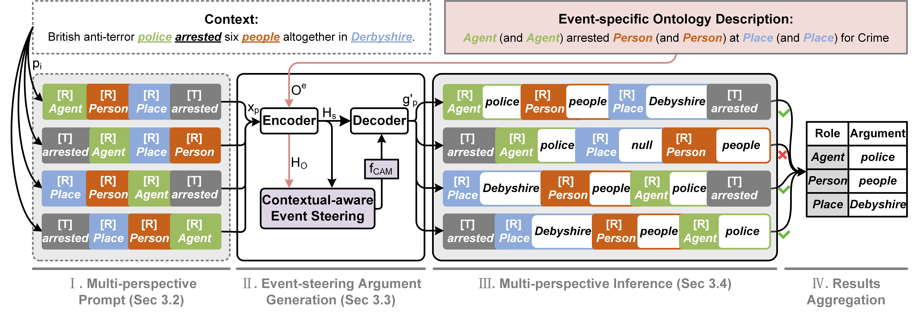

# Overview

Code and implementation details of our paper `GEMS: Generation-Based Event Argument Extractionvia Multi-perspective Prompts and Ontology Steering`, accepted by Findings of ACL 2025.



## Requirements

```
python==3.7
ipdb==0.13.9
numpy==1.21.5
huggingfase-hub==0.16.4
pytorch==1.12.1
transformers==4.14.1
sentencepiece==0.1.96
scikit-learn==1.0.2
```

To install requirements, run 

```
pip install -r requirements.txt
```


## Datasets:

This code utilize `ERE-EN` as an example. For `ACE05-E`, `wikievent` and other datasets, it is only necessary to modify some of the variables in the code that contain the name of the dataset. 


### Preprocessing

Following [AMPERE](https://github.com/PlusLabNLP/AMPERE/tree/main), our preprocessing mainly adapts [OneIE's](https://blender.cs.illinois.edu/software/oneie/) and [DEGREE's](https://github.com/PlusLabNLP/DEGREE) released scripts with minor modifications. We deeply thank the contribution from the authors of the paper.


#### `ACE05-E`
1. Prepare data processed from [DyGIE++](https://github.com/dwadden/dygiepp#ace05-event)
2. Put the processed data into the folder `processed_data/ace05e_dygieppformat`
3. Run `./scripts/process_ace05e.sh`

#### `ERE-EN`
1. Download ERE English data from LDC, specifically, "LDC2015E29_DEFT_Rich_ERE_English_Training_Annotation_V2", "LDC2015E68_DEFT_Rich_ERE_English_Training_Annotation_R2_V2", "LDC2015E78_DEFT_Rich_ERE_Chinese_and_English_Parallel_Annotation_V2"
2. Collect all these data under a directory with such setup:
```
ERE
├── LDC2015E29_DEFT_Rich_ERE_English_Training_Annotation_V2
│     ├── data
│     ├── docs
│     └── ...
├── LDC2015E68_DEFT_Rich_ERE_English_Training_Annotation_R2_V2
│     ├── data
│     ├── docs
│     └── ...
└── LDC2015E78_DEFT_Rich_ERE_Chinese_and_English_Parallel_Annotation_V2
      ├── data
      ├── docs
      └── ...
```
3. Run `./scripts/process_ere.sh`

The above scripts will generate processed data in `./process_data`.

#### `wikievent`

Following [PAIE's](https://github.com/mayubo2333/PAIE) operation.

#### Convert to GEMS input format

Finally, convert all dataset above into the following format for train, dev and test.

~~~json
{
    "sentence": ["The", "call", "reflected", "the", "insistent", "demand", "made", "by",    "the", "three", "leaders", "before", "the", "US", "-", "British", "invasion", "of", "Iraq", "that", "UN", "approval", "was", "essential", "for", "any", "mission", "to", "topple", "Iraqi", "President", "Saddam", "Hussein", "."],
    "events": [
        {
            "trigger": {
                "start": 16,
                "end": 17,
                "words": "invasion",
                "type": "Conflict.Attack"
            },
            "arguments": [
                {
                    "head": 13,
                    "tail": 14,
                    "words": "US",
                    "role": "Attacker"
                },
                {
                    "head": 15,
                    "tail": 16,
                    "words": "British",
                    "role": "Attacker"
                }
            ]
        }
    ]
}

~~~

### Low-resource settings

Following [DEGREE](https://github.com/PlusLabNLP/DEGREE) and [AMPERE](https://github.com/PlusLabNLP/AMPERE/tree/main), we utilize different proportions (1%, 2%, 3%, 5%, 10%, 20%, 30%, and 50%) of training data to study the influence of the size of the training set and use the original development set and test set for evaluation. The details are put in `./resource/low_resource_split` folder.


## Train and evaluate

### Model prepare 

We utilize [T5-large](https://huggingface.co/google-t5/t5-large) in GEMS, which are put in `./model/` folder.


### Run code

Taking the ERE-EN dataset with 30% training data as an example, to train the GEMS model, run:

```
bash ./scripts/run_ERE-EN_030.sh
```

## Citation

```


```


